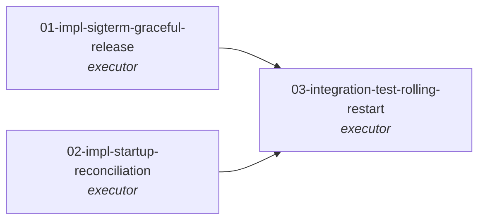

# Topology

T1 and T2 are independent (different code paths, different lifecycle
hooks in the same controller). T3 depends on both because the
integration test exercises the combined fix: SIGTERM cleanup handles
the common case; startup reconciliation backstops the SIGTERM-failed
case (OOM kill, node loss, prior-version pod).

# Why this DAG

The architectural design for both halves of the fix already exists in
`viloforge-platform/docs/vafi-runtime-DESIGN.md`:

- §"Phase 5 — Draining (SIGTERM received)" — T1
- §"The startup-reconciliation invariant" — T2

That document specifies handler structure, time budgets, fallback
behavior, and the chosen API call (`unclaim`). The work in this DAG
is **executor-tier**: turn pre-existing design into code, tests, and
verified behavior.

This is `kind: bugfix` (per `implementation-roadmap-PLAN.md` §"Phase
1"), and we deliberately use a **flat 3-task DAG** rather than the
split design/impl pattern shown in
`project-repo-DESIGN.md` §"Worked example". Rationale: the
architectural design is already done; per-task spec-author work
will resolve file paths and acceptance criteria; adding a `design-*`
task per impl would duplicate that. See plan.md for the full
methodology argument.

# DAG-level acceptance criteria

- **AC-1.** All three tasks `done` with judge approval.
- **AC-2.** SIGTERM delivered to a running executor pod with an
  in-flight claim SHALL result in that claim transitioning from
  `doing → todo` (with `claimed_by` cleared) before the pod exits,
  within `terminationGracePeriodSeconds - 5s`.
- **AC-3.** Executor pod startup, after registration, SHALL query
  `GET /v2/agents/<self-id>/tasks/?status=doing` and call
  `POST /v2/tasks/<id>/unclaim/` for every returned task, before
  entering the claim poll loop.
- **AC-4.** An induced rolling restart of the executor Deployment
  (with at least one task in `doing` at restart time) MUST leave
  zero tasks stranded in `doing` claimed by the dying pod's agent
  ID. Verified by an **ephemeral-cluster (kind or k3d) integration
  test running in CI on every PR** — chosen over a vafi-dev real-
  cluster test because the orphan-recovery behavior under test is
  controller-lifecycle (SIGTERM, registration, claim, restart), not
  deployment-shape-specific. Real-cluster smoke under ArgoCD
  rolling is explicitly out of scope (different evidential target,
  separate workgraph if/when wanted).
- **AC-5.** The fix MUST NOT introduce a new vtaskforge endpoint or
  modify any vtaskforge-side code. (Phase 1 single-repo constraint.)
- **AC-6.** vafi#4 closed with a verification comment linking to the
  merged PR and the T3 integration-test run output.

# Out of scope

- Resumable harnesses (re-attaching to a partial harness session).
  Tracked separately.
- Server-side claim-TTL based on heartbeat freshness.
- Dedicated `/v2/tasks/<id>/release/` endpoint or `reason` field on
  unclaim. Current pod-log-based audit is sufficient for now.
- Multi-replica fan-out under a shared agent ID. Current
  `agents/<id>/tasks/` filters by user account, so startup
  reconciliation under N>1 active replicas with shared agent ID is
  unsafe. Deployment must enforce max-1-active-replica-per-agent-ID
  (e.g., `maxSurge=1, maxUnavailable=0`); enforcing this at the
  vafi side is a separate workgraph if/when needed.

# References

- vafi#4: https://github.com/viloforge/vafi/issues/4
- observations/obs_jsWWsQ.md
- viloforge-platform/docs/vafi-runtime-DESIGN.md §"Phase 5 — Draining"
- viloforge-platform/docs/vafi-runtime-DESIGN.md §"The startup-reconciliation invariant"
- viloforge-platform/docs/implementation-roadmap-PLAN.md §"Phase 1 — Manual SDD validation"
- kb gotcha `5CB2E6x4` (vafi area)
