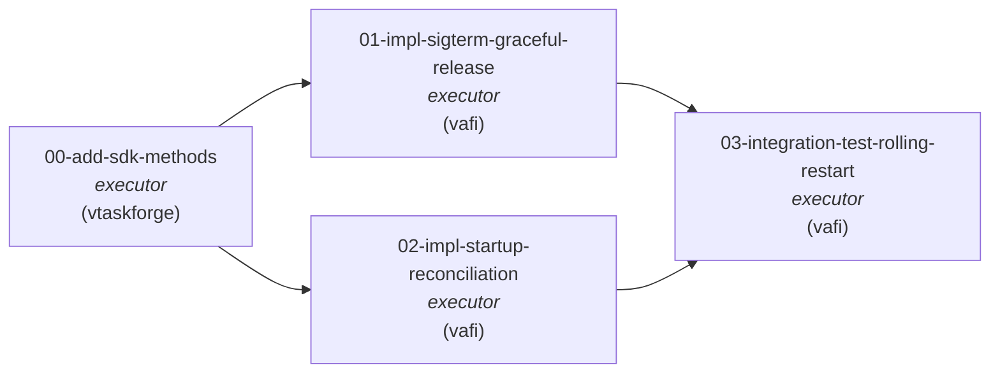

# Topology

T0 adds three missing SDK methods to vtf-sdk-python that the async
client doesn't expose today (`AsyncTaskManager.unclaim`,
`AgentManager.tasks`, `AsyncAgentManager.tasks` — mirroring already-
existing endpoints in vtaskforge). T1 and T2 each consume one of
these methods, so both depend on T0. T1 and T2 are independent of
each other (different code paths, different lifecycle hooks in the
same controller). T3 depends on T1 + T2 because the integration test
exercises the combined fix: SIGTERM cleanup handles the common case;
startup reconciliation backstops the SIGTERM-failed case (OOM kill,
node loss, prior-version pod).

**On the cross-repo scope.** T0's `target_repo: vtaskforge` was added
during spec-author phase, not architect phase. The architect-phase
investigation (P3 in `architect-retro.md`) verified that the
*endpoints* existed in vtaskforge but did not verify that the
*async SDK* exposed them — only the sync SDK does. The walk-back is
captured in architect-retro `P12` and the "Phase 1 single-repo"
footnote there. Adding T0 to the DAG is the honest representation
of the work needed; trying to preserve a strict single-repo framing
would have hidden the multi-repo coordination inside spec bodies,
which architect-retro X3 warns against.

# Why this DAG

The architectural design for both halves of the fix already exists in
`viloforge-platform/docs/vafi-runtime-DESIGN.md`:

- §"Phase 5 — Draining (SIGTERM received)" — T1
- §"The startup-reconciliation invariant" — T2

That document specifies handler structure, time budgets, fallback
behavior, and the chosen API call (`unclaim`). The work in this DAG
is **executor-tier**: turn pre-existing design into code, tests, and
verified behavior.

This is `kind: bugfix` (per `implementation-roadmap-PLAN.md` §"Phase
1"), and we deliberately use a **flat 3-task DAG** rather than the
split design/impl pattern shown in
`project-repo-DESIGN.md` §"Worked example". Rationale: the
architectural design is already done; per-task spec-author work
will resolve file paths and acceptance criteria; adding a `design-*`
task per impl would duplicate that. See plan.md for the full
methodology argument.

# DAG-level acceptance criteria

- **AC-1.** All three tasks `done` with judge approval.
- **AC-2.** SIGTERM delivered to a running executor pod with an
  in-flight claim SHALL result in that claim transitioning from
  `doing → todo` (with `claimed_by` cleared) before the pod exits,
  within `terminationGracePeriodSeconds - 5s`.
- **AC-3.** Executor pod startup, after registration, SHALL query
  `GET /v2/agents/<self-id>/tasks/?status=doing` and call
  `POST /v2/tasks/<id>/unclaim/` for every returned task, before
  entering the claim poll loop.
- **AC-4.** An induced rolling restart of the executor Deployment
  (with at least one task in `doing` at restart time) MUST leave
  zero tasks stranded in `doing` claimed by the dying pod's agent
  ID. Verified by an **ephemeral-cluster (local kind, by default)
  integration test invoked via `make integration-test-rolling-restart`**.
  The test logic is environment-agnostic (uses `KUBECONFIG`-pointed
  cluster) so the same test can later run unchanged in CI. CI
  wiring itself is OUT OF SCOPE for this workgraph and deferred to
  a follow-up `kind: infrastructure` workgraph (architect-retro W4
  walk-back; see Q6). Real-cluster smoke under ArgoCD rolling
  remains explicitly out of scope (different evidential target,
  separate workgraph if/when wanted).
- **AC-5.** The fix MUST NOT introduce a new vtaskforge **server-side**
  endpoint or modify any vtaskforge model/view code. The SDK-method
  additions in T0 (within `vtaskforge/vtf-sdk-python/`) are
  permitted — they expose endpoints that already exist server-side.
  (Phase 1 "single-repo" constraint walked back to "single-server-
  side-repo" — see architect-retro.md P12 footnote.)
- **AC-6.** vafi#4 closed with a verification comment linking to the
  merged PR and the T3 integration-test run output.

# Out of scope

- Resumable harnesses (re-attaching to a partial harness session).
  Tracked separately.
- Server-side claim-TTL based on heartbeat freshness.
- Dedicated `/v2/tasks/<id>/release/` endpoint or `reason` field on
  unclaim. Current pod-log-based audit is sufficient for now.
- Multi-replica fan-out under a shared agent ID. Current
  `agents/<id>/tasks/` filters by user account, so startup
  reconciliation under N>1 active replicas with shared agent ID is
  unsafe. Deployment must enforce max-1-active-replica-per-agent-ID
  (e.g., `maxSurge=1, maxUnavailable=0`); enforcing this at the
  vafi side is a separate workgraph if/when needed.

# References

- vafi#4: https://github.com/viloforge/vafi/issues/4
- observations/obs_jsWWsQ.md
- viloforge-platform/docs/vafi-runtime-DESIGN.md §"Phase 5 — Draining"
- viloforge-platform/docs/vafi-runtime-DESIGN.md §"The startup-reconciliation invariant"
- viloforge-platform/docs/implementation-roadmap-PLAN.md §"Phase 1 — Manual SDD validation"
- kb gotcha `5CB2E6x4` (vafi area)
